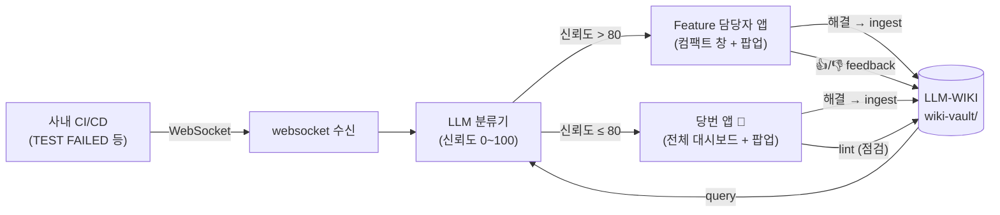

# Sheriff aVatar Project (SVP)

LLM-WIKI 기반 Sheriff Agent — CI/CD 이슈를 WebSocket으로 수신해 LLM이 분류하고,
신뢰도 점수에 따라 Feature 담당자 또는 Sheriff(당번)에게 배정하는 Windows 데스크톱 앱.

## 큰 그림

팀원 전원(예: A, B, C — C가 당번)이 EXE로 Sheriff Avatar를 설치한다.
일반 팀원은 **자기에게 배정된 이슈만** 작은 창으로 받고, 당번은 **팀 전체 이슈**를 대시보드로 본다.
LLM-WIKI(`wiki-vault/`)는 분류의 근거이자 처리 결과가 다시 쌓이는 곳이다 — 쓸수록 똑똑해진다.



## 한 사이클 (이슈 하나의 흐름)

1. 사내 CI/CD에서 `test_failed` 발생 → WebSocket으로 앱 수신
2. **query**: 앱이 wiki-vault에서 관련 노트 검색 (known-failure, 과거 케이스)
3. LLM 분류기가 노트를 근거로 이슈를 분류하고 **신뢰도 점수** 산출
4. 라우팅 — **80점 초과**: 해당 모듈 담당자에게 자동 배정 / **80점 이하**: 당번에게 배정 (human-in-the-loop)
5. 배정된 사람의 앱에 **우하단 팝업** 알림 (당번은 모든 이슈 알림 수신)
6. 담당자가 확인 → 처리 → 앱에서 "해결 완료"
7. **ingest**: 처리 결과가 `case-log.md`에 기록되고 `index.md`/`log.md` 갱신 → 다음번 같은 유형 이슈의 신뢰도가 올라감
8. **feedback**: 담당자가 참조된 wiki 노트에 👍/👎 — 부정 누적 노트는 검색에서 감점
9. **lint**: 당번이 주기적으로 "WIKI 점검" — 고아 노트·저품질 노트를 정리 후보로 보고

이 루프가 반복되며 wiki가 축적되고, 자동 배정 비율(신뢰도 >80)이 점점 올라가는 것이 목표다.

## 기존 솔루션과 무엇이 다른가

CI 실패 티켓 triage 자체는 새 문제가 아니다. 기존 접근들과의 차이는 **"분류가 지식을 남기고, 그 지식이 다음 분류를 바꾸는가"**에 있다.

| | 규칙 기반 자동화 (Jira Automation 등) | 일회성 LLM 분류 (프롬프트 래퍼) | **SVP (LLM-WIKI)** |
|---|---|---|---|
| 분류 근거 | 사람이 만든 정적 규칙 | 모델의 일반 지식뿐 | **팀의 해결 이력** (`wiki-vault/` known-failure + case-log) |
| 시간이 지나면 | 규칙 유지보수 부채 | 항상 제로베이스 | **해결할수록 정확해짐** — resolved 티켓이 자동으로 다음 분류의 근거가 됨 (F7 ingest) |
| 모르는 이슈 | 잘못 라우팅되거나 방치 | 그럴듯하게 추측 (환각 위험) | **신뢰도 ≤80이면 사람(당번)에게** — 임계값이 자동화와 사람 판단의 명시적 경계 (F4 수동 재배정 = human-in-the-loop의 손) |
| 증거 보존 | 티켓 링크뿐 (로그는 로테이션으로 소실) | 없음 | **해결 시점 원문 동결** (`raw/` — Jenkins 콘솔은 수개월 뒤 사라지지만 vault에는 남는다) |
| 지식 품질 관리 | 없음 | 없음 | **피드백 루프** — 👎 누적 노트는 검색 감점 → lint가 정리 후보로 (쓸데없는 지식은 스스로 제거) |
| 안전장치 | 규칙이 곧바로 실행 | 보통 없음 | **3단 write 게이트** (`dry-run`/`label`/`live`) — 검증 전엔 실티켓을 절대 건드리지 않음 |

설계 원칙은 Karpathy의 [llm-wiki 컨셉](./docs/llm-wiki-concept.md)이다: **wiki의 1차 독자는 사람이 아니라 LLM**이고,
raw(불변 증거) → wiki(압축 지식) → schema(규칙)의 3계층을 유지한다. LLM이 지어내지 못하게 하는 규칙
(근거 없는 원인은 "추정:" 접두사, 모르면 "(불명)")까지 분류·기록 프롬프트에 명시되어 있다 (`server/classifier.mjs`).

또 하나의 차이는 **실환경에서 이미 동작한다**는 것 — 사내 Jira 폴링, 티켓에 링크된 Jenkins 중계 빌드를 따라가
실패 샤드 콘솔(~9MB)에서 해당 TC의 실행 구간만 추출하는 경로까지 실티켓으로 검증됐다 (`server/jenkins.mjs`).

## 요구 사항

- Node.js 20+ / npm
- Windows 10/11

## 시작하기

```bash
npm install

# 터미널 1: mock CI/CD 서버 (ws://localhost:8790)
npm run mock:ci

# 터미널 2: 앱 개발 모드
npm run dev
```

mock 서버가 주기적으로 CI 이슈 이벤트를 보내면, 앱이 분류·배정 후
화면 우하단에 팝업 알림을 띄운다. 앱 사이드바에서 사용자(A/B/C)를 전환하며
"일반 팀원은 자기 이슈만 / 당번은 전체 이슈" 동작을 확인할 수 있다.

실제 CI/CD 서버 주소는 환경변수로 지정한다:

```bash
set SVP_CI_WS_URL=wss://ci.example.com/events
```

## EXE 인스톨러 빌드

```bash
npm run dist
# → dist/Sheriff Avatar Setup 0.1.0.exe
```

## 병합 후 검증 체크리스트 (필수)

브랜치 merge 후, 그리고 **사내에서 pull 받은 직후**에는 반드시 아래를 순서대로 실행한다.
하나라도 실패하면 merge를 되돌리거나 즉시 fix를 올린다.

```bash
npm install          # 1. package-lock.json이 바뀐 경우 (merge 후엔 습관적으로 실행 권장)
npm run typecheck    # 2. 타입 체크 통과
npm run build        # 3. 프로덕션 빌드 성공
npm run mock:ci      # 4. (터미널 1) mock 서버
npm run dev          # 5. (터미널 2) 스모크 테스트 →
```

스모크 테스트에서 확인할 것 (약 1분):

- [ ] 사이드바에 초록색 "CI/CD 연결됨" 표시
- [ ] 새 이슈 수신 시 우하단 팝업이 뜨고, 클릭하면 해당 이슈로 이동
- [ ] 사용자 전환: member → 컴팩트 창(내 이슈만) / sheriff → 대시보드(전체 이슈)
- [ ] 이슈 "해결 완료" → `wiki-vault/case-log.md`·`log.md`·`index.md` 자동 갱신
- [ ] "🔍 WIKI 점검" 버튼이 보고서 카드를 띄움

### 병합 시 주의: wiki-vault 자동 갱신 파일

`wiki-vault/`의 `index.md`, `log.md`, `case-log.md`는 앱이 런타임에 수정한다.
**mock 서버로 테스트하며 생긴 변경은 커밋하지 말고 `git restore wiki-vault`로 되돌린다.**
(실제 사내 데이터 축적 시작 후의 커밋 정책은 Week 3에 재논의 — docs/PLAN.md)
이 파일들에서 merge conflict가 나면 append-only 특성상 대부분 양쪽을 모두 남기면 된다.

## 운영 원칙 (사내/사외)

- 이 repo(사외 GitHub)가 **유일한 개발 저장소**다. 모든 코드 작성은 사외에서 한다.
- 사내망에서는 `git pull`만 수행해 테스트한다. **사내 → 사외 push는 절대 금지.**
- 사내 테스트에서 에러 발견 → 에러 내용(민감정보 제거)을 사외로 전달 → 사외에서 수정 → 사내에서 다시 pull.

## 문서

- [CLAUDE.md](./CLAUDE.md) — 개발 규칙, 커밋 규칙, 모듈 맵 (Claude 사용 시 필독)
- [docs/ARCHITECTURE.md](./docs/ARCHITECTURE.md) — 목표 구조 (클라이언트·서버 + Jira 중심) 와 데이터 흐름
- [docs/API.md](./docs/API.md) — 클라이언트↔서버 WS·Jira REST·LLM 계약 명세
- [docs/BACKEND.md](./docs/BACKEND.md) — 백엔드 핵심 기능(F1~F8) 명세와 완료 기준
- [docs/DEMO-SCENARIO.md](./docs/DEMO-SCENARIO.md) — 데모 시나리오 (15분, 4장면)
- [wiki-vault/](./wiki-vault/) — LLM-WIKI (Obsidian으로 열 수 있음)
