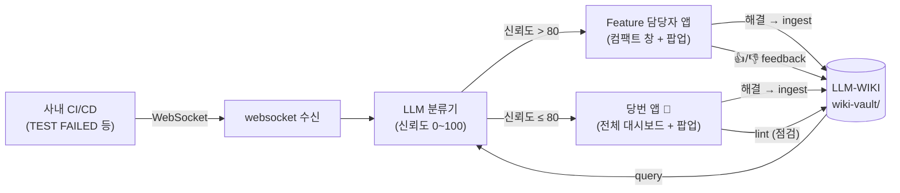

# Sheriff aVatar Project (SVP)

LLM-WIKI 기반 Sheriff Agent — CI/CD 이슈를 WebSocket으로 수신해 LLM이 분류하고,
신뢰도 점수에 따라 Feature 담당자 또는 Sheriff(당번)에게 배정하는 Windows 데스크톱 앱.

## 큰 그림

팀원 전원(예: A, B, C — C가 당번)이 EXE로 Sheriff Avatar를 설치한다.
일반 팀원은 **자기에게 배정된 이슈만** 작은 창으로 받고, 당번은 **팀 전체 이슈**를 대시보드로 본다.
LLM-WIKI(`wiki-vault/`)는 분류의 근거이자 처리 결과가 다시 쌓이는 곳이다 — 쓸수록 똑똑해진다.



## 한 사이클 (이슈 하나의 흐름)

1. 사내 CI/CD에서 `test_failed` 발생 → WebSocket으로 앱 수신
2. **query**: 앱이 wiki-vault에서 관련 노트 검색 (known-failure, 과거 케이스)
3. LLM 분류기가 노트를 근거로 이슈를 분류하고 **신뢰도 점수** 산출
4. 라우팅 — **80점 초과**: 해당 모듈 담당자에게 자동 배정 / **80점 이하**: 당번에게 배정 (human-in-the-loop)
5. 배정된 사람의 앱에 **우하단 팝업** 알림 (당번은 모든 이슈 알림 수신)
6. 담당자가 확인 → 처리 → 앱에서 "해결 완료"
7. **ingest**: 처리 결과가 `case-log.md`에 기록되고 `index.md`/`log.md` 갱신 → 다음번 같은 유형 이슈의 신뢰도가 올라감
8. **feedback**: 담당자가 참조된 wiki 노트에 👍/👎 — 부정 누적 노트는 검색에서 감점
9. **lint**: 당번이 주기적으로 "WIKI 점검" — 고아 노트·저품질 노트를 정리 후보로 보고

이 루프가 반복되며 wiki가 축적되고, 자동 배정 비율(신뢰도 >80)이 점점 올라가는 것이 목표다.

## 요구 사항

- Node.js 20+ / npm
- Windows 10/11

## 시작하기

```bash
npm install

# 터미널 1: mock CI/CD 서버 (ws://localhost:8790)
npm run mock:ci

# 터미널 2: 앱 개발 모드
npm run dev
```

mock 서버가 주기적으로 CI 이슈 이벤트를 보내면, 앱이 분류·배정 후
화면 우하단에 팝업 알림을 띄운다. 앱 사이드바에서 사용자(A/B/C)를 전환하며
"일반 팀원은 자기 이슈만 / 당번은 전체 이슈" 동작을 확인할 수 있다.

실제 CI/CD 서버 주소는 환경변수로 지정한다:

```bash
set SVP_CI_WS_URL=wss://ci.example.com/events
```

## EXE 인스톨러 빌드

```bash
npm run dist
# → dist/Sheriff Avatar Setup 0.1.0.exe
```

## 운영 원칙 (사내/사외)

- 이 repo(사외 GitHub)가 **유일한 개발 저장소**다. 모든 코드 작성은 사외에서 한다.
- 사내망에서는 `git pull`만 수행해 테스트한다. **사내 → 사외 push는 절대 금지.**
- 사내 테스트에서 에러 발견 → 에러 내용(민감정보 제거)을 사외로 전달 → 사외에서 수정 → 사내에서 다시 pull.

## 문서

- [CLAUDE.md](./CLAUDE.md) — 개발 규칙, 커밋 규칙, 모듈 맵 (Claude 사용 시 필독)
- [docs/ARCHITECTURE.md](./docs/ARCHITECTURE.md) — 데이터 흐름과 모듈 설계
- [wiki-vault/](./wiki-vault/) — LLM-WIKI (Obsidian으로 열 수 있음)
