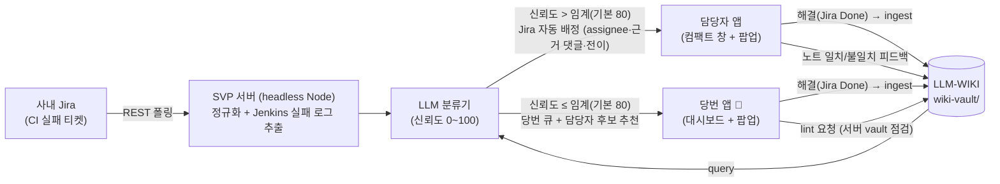

# Sheriff aVatar Project (SVP)

LLM-WIKI 기반 CI 실패 티켓 triage 자동화 — 서버가 Jira를 폴링해 CI 실패 티켓을 수집하고,
LLM이 팀의 해결 이력(`wiki-vault/`)을 근거로 분류해 **신뢰도 점수(0~100)** 에 따라
담당자에게 자동 배정하거나 Sheriff(당번)에게 넘기는 Windows 데스크톱 앱 + headless 서버.

## 큰 그림

팀원 전원이 EXE로 Sheriff Avatar를 설치한다.
일반 팀원은 **자기에게 배정된 이슈만** 작은 창으로 받고, 당번은 **팀 전체 이슈**를 대시보드로 본다.
LLM-WIKI(`wiki-vault/`)는 분류의 근거이자 처리 결과가 다시 쌓이는 곳이다 — 쓸수록 똑똑해진다.


```mermaid
flowchart LR
    JIRA["사내 Jira<br/>(CI 실패 티켓)"] -- "REST 폴링" --> SRV["SVP 서버 (headless Node)<br/>정규화 + Jenkins 실패 로그 추출"]
    WIKI[("LLM-WIKI<br/>wiki-vault/")] -- "query" --> CLS
    SRV --> CLS["LLM 분류기<br/>(신뢰도 0~100)"]
    CLS -- "신뢰도 > 임계(기본 80)<br/>Jira 자동 배정 (assignee·근거 댓글·전이)" --> OWNER["담당자 앱<br/>(컴팩트 창 + 팝업)"]
    CLS -- "신뢰도 ≤ 임계(기본 80)<br/>당번 큐 + 담당자 후보 추천" --> SHERIFF["당번 앱 🤠<br/>(대시보드 + 팝업)"]
    OWNER -- "해결(Jira Done) → ingest" --> WIKI
    SHERIFF -- "해결(Jira Done) → ingest" --> WIKI
    OWNER -- "노트 일치/불일치 피드백" --> WIKI
    SHERIFF -- "lint 요청 (서버 vault 점검)" --> WIKI
```

앱(Electron)은 순수 클라이언트다 — 로그인하면 서버가 Socket.IO로 본인 몫의 이슈를 push하고,
우하단 팝업으로 알린다. 분류·배정·wiki 갱신은 전부 서버(`server/`)가 수행한다.

## 한 사이클 (이슈 하나의 흐름)

1. CI 실패 → Jira 티켓 생성 → 서버가 REST 폴링으로 감지 (`SVP_SERVER_POLL_MS`, 기본 5초)
2. 티켓에 링크된 Jenkins 중계 빌드를 따라가 **실패 샤드 콘솔에서 해당 TC의 실행 구간만 추출**해 첨부
3. **query**: 서버가 wiki-vault에서 관련 노트 검색 (키워드 매칭 + LLM 드릴다운)
4. LLM 분류기가 노트를 근거로 이슈를 분류하고 **신뢰도 점수** 산출
5. 라우팅 — **80점 초과**: 노트의 owner에게 Jira 자동 배정(assignee + 근거 댓글 + In Progress 전이) /
   **80점 이하**: 당번 큐 + **담당자 후보 추천**(Gerrit 마지막 커미터 + wiki owner) 첨부 (human-in-the-loop)
6. 배정된 사람의 앱에 **우하단 팝업** 알림 (당번은 모든 이슈를 대시보드로)
7. 담당자가 Jira에서 해결(Done) → 서버가 감지
8. **ingest**: 원문을 `raw/`에 동결하고 LLM이 증상·원인·해결을 요약해 `case-log.md`에 기록,
   `index.md`/`log.md` 자동 갱신 → 다음번 같은 유형 이슈의 신뢰도가 올라감
9. **feedback**: 담당자가 "참조 노트의 원인이 실제와 일치했나?"를 앱에서 판정 — 불일치 누적 노트는 검색 감점
10. **lint**: 당번이 "위키 점검"을 누르면 서버가 vault를 점검 — 고아 노트, frontmatter 스키마 위반,
    노트 공백(티켓은 오는데 노트가 없는 카테고리), 피드백 불일치 누적 노트를 헬스 스코어와 함께 보고

이 루프가 반복되며 wiki가 축적되고, 자동 배정 비율(신뢰도 >80)이 점점 올라가는 것이 목표다.

## 기존 솔루션과 무엇이 다른가

CI 실패 티켓 triage 자체는 새 문제가 아니다. 기존 접근들과의 차이는 **"분류가 지식을 남기고, 그 지식이 다음 분류를 바꾸는가"**에 있다.

| | 규칙 기반 자동화 (Jira Automation 등) | 일회성 LLM 분류 (프롬프트 래퍼) | **SVP (LLM-WIKI)** |
|---|---|---|---|
| 분류 근거 | 사람이 만든 정적 규칙 | 모델의 일반 지식뿐 | **팀의 해결 이력** (`wiki-vault/` known-failure + case-log) |
| 시간이 지나면 | 규칙 유지보수 부채 | 항상 제로베이스 | **해결할수록 정확해짐** — resolved 티켓이 자동으로 다음 분류의 근거가 됨 (ingest) |
| 모르는 이슈 | 잘못 라우팅되거나 방치 | 그럴듯하게 추측 (환각 위험) | **신뢰도 ≤80이면 사람(당번)에게** — 임계값이 자동화와 사람 판단의 명시적 경계. 당번에게는 담당자 후보(Gerrit 커미터 + wiki owner)까지 추천 |
| 증거 보존 | 티켓 링크뿐 (로그는 로테이션으로 소실) | 없음 | **해결 시점 원문 동결** (`raw/` — Jenkins 콘솔은 수개월 뒤 사라지지만 vault에는 남는다) |
| 지식 품질 관리 | 없음 | 없음 | **retrieval self-correction** — 재발한 유형은 가중(recurrence boost), reopen 후 재해결되면 옛 결론을 대체(supersede), 불일치 피드백 누적 노트는 감점 → lint가 정리 후보로. 셋 다 단위 테스트로 검증 |
| 안전장치 | 규칙이 곧바로 실행 | 보통 없음 | **3단 write 게이트** (`dry-run`/`label`/`live`) — 검증 전엔 실티켓을 절대 건드리지 않음 |

설계 원칙은 Karpathy의 [llm-wiki 컨셉](./docs/llm-wiki-concept.md)이다: **wiki의 1차 독자는 사람이 아니라 LLM**이고,
raw(불변 증거) → wiki(압축 지식) → schema(규칙)의 3계층을 유지한다. LLM이 지어내지 못하게 하는 규칙
(근거 없는 원인은 "추정:" 접두사, 모르면 "(불명)")까지 분류·기록 프롬프트에 명시되어 있다 (`server/classifier.mjs`).
신뢰도 자체도 프롬프트에서 wiki 증거 강도 기준 4구간(85–95 직접 매치 / 65–80 모듈은 맞지만 패턴 미기록 /
51–64 약한 근거 / 50 이하 무근거)으로 캘리브레이션되고, "직접 매치는 반드시 80을 넘긴다"가 명문화되어 있다 —
자동 배정 임계값(기본 80)이 이 밴드 경계에 근거한다.

파이프라인은 mock 환경뿐 아니라 사내 Jira/Jenkins 대상 dry-run으로도 검증했다 — 실티켓에 링크된
Jenkins 중계 빌드를 따라가 실패 샤드 콘솔(수 MB)에서 해당 TC 구간만 추출하는 경로 포함
(`server/jenkins.mjs`, 절차: [docs/SETUP.md](./docs/SETUP.md)).

## 기술 스택

| 구분 | 스택 |
|---|---|
| 클라이언트 | Electron 33 + React 18 + TypeScript (strict), electron-vite |
| 서버 | headless Node 20 (plain `.mjs`), Linux systemd 운영 가정 |
| 실시간 push | Socket.IO 4 |
| LLM | Claude (Bedrock / Anthropic API, provider 전환 가능 + 실패 시 fallback) |
| 지식 저장소 | `wiki-vault/` — Obsidian 호환 마크다운 (DB 없음, git으로 리뷰 가능) |
| 테스트 | `node --test` — 서버 순수 함수 49 테스트 |

## 시작하기

요구 사항: Node.js 22+ 권장(`npm test`의 glob 패턴은 Node 21+ 필요) / Windows 10/11 (서버는 Linux 가능).
로컬은 mock Jira/Jenkins로 전체 파이프라인을 띄운다.

```bash
npm install

# 터미널 1: mock Jira (8792)
npm run mock:jira

# 터미널 2: mock Jenkins (8794) — 콘솔 로그 소스
npm run mock:jenkins

# 터미널 3: 서버 (8793) — 폴링·분류·배정·push
npm run server

# 터미널 4: 앱 개발 모드
npm run dev
```

로그인으로 역할이 정해진다 — **admin/admin = 당번(전체 이슈)**, **아이디=비밀번호 = 팀원(자기 이슈만)**.
서버가 mock Jira의 티켓을 폴링해 분류·배정하면 앱이 화면 우하단에 팝업 알림을 띄운다.
새 티켓은 `POST http://localhost:8792/demo/trigger`로 재현한다([docs/API.md](./docs/API.md)).

실제 Jira/Jenkins 접속과 write 게이트(`dry-run`/`label`/`live`) 설정은 `.env`에 둔다 —
[.env.example](./.env.example)와 [docs/SETUP.md](./docs/SETUP.md) 참고.
사내 전용 자산(로그 수집 tool, 스킬, MCP)은 [docs/INTERNAL-ASSETS.md](./docs/INTERNAL-ASSETS.md)의 템플릿으로 관리한다.

## 검증

```bash
npm run typecheck        # TS strict 타입 체크
npm test                 # 서버 순수 함수 49 테스트 (ingest 중복 제거·retrieval self-correction·로그 정형화 판정)
npm run test:coverage    # 위 테스트 + 커버리지 리포트 (node --test --experimental-test-coverage)
npm run build            # 프로덕션 빌드
npm run dist             # Windows EXE 인스톨러 → dist/Sheriff Avatar Setup 0.1.0.exe
```

스모크 테스트 (mock 4프로세스 + admin/admin 로그인, 약 1분):

- [ ] 서버 콘솔에 seed 티켓 폴링 로그(`new CIOPS-...`)와 `classifier: on/off` 표시
- [ ] 새 이슈 수신 시 우하단 팝업이 뜨고, 클릭하면 해당 이슈로 이동
- [ ] 로그인 역할: 팀원(아이디=비밀번호) → 컴팩트 창(내 이슈만) / 당번(admin/admin) → 대시보드(전체 이슈)
- [ ] 티켓을 Jira에서 Done → `wiki-vault/case-log.md`·`log.md`·`index.md` 갱신 (`SVP_INGEST_MODE=live`일 때)
- [ ] "위키 점검" 버튼이 보고서 카드를 띄움

### 주의: wiki-vault 자동 갱신 파일

`wiki-vault/`의 `index.md`, `log.md`, `case-log.md`는 서버가 런타임에 수정한다.
**mock 서버로 테스트하며 생긴 변경은 커밋하지 말고 `git restore wiki-vault`로 되돌린다.**
이 파일들에서 merge conflict가 나면 append-only 특성상 대부분 양쪽을 모두 남기면 된다.

## 문서

- [CLAUDE.md](./CLAUDE.md) — 개발 규칙, 커밋 규칙, 모듈 맵
- [docs/PRD.md](./docs/PRD.md) — 제품 요구사항 (문제 정의·목표·비목표·품질/안전 요구·알려진 한계)
- [docs/ARCHITECTURE.md](./docs/ARCHITECTURE.md) — 현행 아키텍처 (서버·클라이언트 + Jira 중심)와 파이프라인 상세
- [docs/API.md](./docs/API.md) — 클라이언트↔서버 Socket.IO·Jira REST·LLM·Jenkins 계약
- [docs/BACKEND.md](./docs/BACKEND.md) — 기능 명세와 완료 기준·검증 방법
- [docs/DEMO-SCENARIO.md](./docs/DEMO-SCENARIO.md) — 데모 시나리오 (3~5분, 4장면)
- [docs/demo/opening-problem-slide.html](./docs/demo/opening-problem-slide.html) — 데모 영상용 오프닝(문제 정의) 슬라이드
- [docs/ROI.md](./docs/ROI.md) — 도입 효과 추정 (사내 실측 기반: 일 294건 × triage 20~30분 vs 당번 3~4시간)
- [docs/SETUP.md](./docs/SETUP.md) — 설정·배포·트러블슈팅
- [docs/deck/](./docs/deck/) — 발표 슬라이드 (단일 HTML, 의존성 없음)
- [wiki-vault/](./wiki-vault/) — LLM-WIKI (Obsidian으로 열 수 있음)

## 라이선스

[MIT](./LICENSE)
