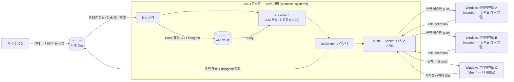

# SVP 아키텍처 (v3 제안 — Linux 서버 · Windows 클라이언트 분리)

> 이 문서는 **목표 구조**를 명세한다. v2(당번 앱 = 서버 겸용)는 W1에 코드로 구현되었고,
> v3는 서버를 **별도 Linux 호스트의 headless 프로세스**로 분리한다 — **2026-07-15 회의에서 채택됨**
> (합의 내용은 바로 아래 절). 차이는 [현재 구현과의 차이](#현재-구현과의-차이),
> 이행 순서는 [v2 → v3 이행 계획](#v2--v3-이행-계획) 참고.
> 세부 명세: [API.md](./API.md) (프로토콜), [BACKEND.md](./BACKEND.md) (백엔드 기능), [DEMO-SCENARIO.md](./DEMO-SCENARIO.md) (데모).

## 합의 사항 (2026-07-15 회의)

- **v3 채택.** Linux 호스트는 김병재가 확보 진행 중 — 확보 전까지 서버 프로세스는 임의 PC에서 실행한다.
- **전송 계층 = Socket.IO 확정** (`SVP_PUSH_URL`, 기본 `http://<서버>:8793`). W1의 raw-WS
  hub/hub-client는 정리 대상이며, 이 문서의 "hub"는 Socket.IO push 서버로 읽는다.
  현행 이벤트 계약은 [API.md §1](./API.md).
- **role은 로그인이 결정한다.** 서버가 로그인 세션에 `{ user, team }`을 내려주고 앱은 그 role의 뷰만
  렌더링한다. 현행 인증은 데모용(admin/admin = 당번, 아이디=비밀번호 = 팀원) — SVP-5에서 실인증으로 교체.
- **배정 원장은 Jira의 assignee 필드.** bot 계정(`cicd_ap`, `SVP_JIRA_BOT`)이면 "사람 배정 전" = 당번 큐.
  **분류기(F3)는 유지** — W2에서 서버 파이프라인에 들어가, 신뢰도 **>80**이면 서버가 assignee를 직접
  지정하고(+요약 댓글), ≤80이면 bot 유지로 당번 큐에 남긴다. 앱은 항상 assignee만 따라간다.
- **Obsidian/vault 열기**: 운영 vault가 서버로 가면, 당번 PC에서 서버의 vault 폴더를 열 수 있게
  연결(공유 폴더 등)하는 단순안으로 간다.
- **프로토타입 현황**: `mock/svp-server.mjs`가 위 구조(폴링 → assignee 라우팅 → Socket.IO push →
  상태 동기화 → ack 전이)를 구현했고 사내 Jira로 검증 완료. `src/server/` 승격 전 임시 위치이며,
  남은 승격 작업: 이슈 저장 영속화 · 실인증(SVP-5) · TypeScript화 · classifier/wiki 통합.

## 토폴로지

- **서버 = Linux 호스트의 headless Node 프로세스** (Electron 의존 없음). 백엔드 전체
  (Jira 폴링 → LLM 분류 → 배정 → Jira 댓글 → 클라이언트 push → WIKI 관리)를 실행하며 systemd 서비스로 상시 가동한다.
  당번 PC의 전원/재부팅과 무관하게 폴링이 지속된다.
- **전원(당번 포함) 앱 = Windows 클라이언트 (동일 EXE).** 당번 대시보드도 일반 팀원과 **같은 WS 프로토콜의
  클라이언트**다. 역할 구분은 서버 측 필터링 하나로 끝난다: member 세션에는 자기 배정분만, sheriff 세션에는
  전체 이슈를 push. 당번 전용 동작(수동 재배정, WIKI 점검)도 같은 WS 위의 role-gated 메시지다.
- **비밀정보는 서버에만 존재한다.** Jira PAT·Claude API key는 서버 호스트의 `.env`에만 두고,
  클라이언트 EXE에는 어떤 자격증명도 배포하지 않는다 (클라이언트 설정은 `SVP_SERVER_URL` 하나).
- 클라이언트는 Jira·WIKI·LLM에 직접 접근하지 않는다 — 모든 것은 서버 경유 (v2와 동일).
- 이슈의 유입은 **Jira 티켓 폴링**이 메인이다. 사내 CI/CD가 실패 시 Jira 티켓을 자동 생성하고(기존 사내 인프라),
  서버가 Jira REST API를 주기 폴링해 신규 티켓을 감지한다.



## 데이터 흐름 (이슈 하나의 사이클)

1. 사내 CI/CD 실패 → **Jira 티켓 자동 생성** (label: `ci-failure` — 기존 사내 인프라)
2. 서버가 Jira를 폴링해 신규 티켓 감지 (기본 30초 주기, 처리 완료 키는 중복 방지 저장)
3. **query** — 티켓의 summary/description/로그로 `wiki-vault/` 검색 (known-failure, 과거 case-log 포함)
4. **classify** — LLM이 티켓 내용 + 매치된 wiki 노트를 읽고 `{category, severity, confidence, summary}` 산출
5. **route** — 신뢰도 **>80**: 해당 모듈 담당자 / **≤80**: 당번 (human-in-the-loop, 당번이 수동 재배정 가능)
6. **Jira 댓글** — 서버가 티켓에 요약 댓글(분류·신뢰도·추정 원인·참고 wiki·배정 근거)을 달고 assignee를 지정
7. **push** — 배정된 팀원의 클라이언트로 `issue:assigned` 전송 → 우하단 팝업. sheriff 세션에는 전체 이슈가 push된다
8. 담당자 처리 → **Jira에서 해결 코멘트 + Done 전이** → 폴링으로 Done 확인.
   **앱에는 해결 버튼이 없다** — 해결 코멘트 없는 Done(기록 근거 없는 해결)을 만들지 않기 위해 쓰기는 Jira 한 곳이다
9. **ingest** — Done 확정 시 **LLM이 Jira 해결 코멘트를 근거로 `case-log.md` 항목을 작성** + `index.md`/`log.md` 갱신
   → **다음 같은 유형 이슈의 신뢰도가 올라간다** (compounding)
10. **feedback/lint** — Done 확정 시 서버가 담당자 앱에 "참조 노트의 원인이 실제 원인과 일치했나요?" toast를
    push (일치/불일치 1클릭, 선택 입력). 불일치 누적 노트는 query 감점 + lint 정리 후보 (해결이 Jira로 이동해도
    피드백 접점 유지)

## 상태 관리 — Jira가 source of truth

| 앱 상태 | Jira 상태 (statusCategory) | 전이 주체 |
|---|---|---|
| `new` | To Do (Open) | CI/CD가 티켓 생성 |
| `acknowledged` | In Progress | 앱의 "티켓 확인" 클릭 (티켓이 열리며 동시에 ack) → 서버가 transition 호출 |
| `resolved` | Done | 담당자가 **Jira에서 Done 처리** (유일 경로) → 폴링으로 확정 |

- 담당자가 Jira에서 직접 상태를 바꿔도 서버가 폴링으로 감지해 앱에 반영한다 (양방향 동기화, Jira 우선).
- ingest는 **Jira에서 Done이 확인된 시점**에 1회만 수행한다.

## 가시성 규칙 & 뷰 모드

- **서버 측 필터링**: member 세션에는 애초에 자기 이슈만 push된다. sheriff 세션에는 전체 이슈가 push된다.
  role은 클라이언트가 주장하지 않고 **서버가 `client:hello`의 `clientId`로 팀 설정에서 판별**한다.
- role = `member`: 컴팩트 창(420×640) — 배정 이슈만 표시/알림
- role = `sheriff`: 전체 대시보드(1180×760) — 팀 전체 이슈 + WIKI 점검 + 수동 재배정.
  UI는 role에 따른 뷰 전환일 뿐, 서버 접속 방식은 member와 동일하다.
- 클라이언트 설정은 `SVP_SERVER_URL` 하나 — v2의 "role=sheriff면 서버 모드로 기동" 분기가 사라진다.

## 모듈 맵 (목표)

```
src/
  server/                  headless Node 서버 (Linux) — Electron import 금지
    index.ts               서버 엔트리: 아래 모듈 배선 (폴링→분류→배정→push)
    modules/jira/          Jira 폴링·댓글·assignee·transition (F1·F5·F7)
    modules/classifier/    LLM 분류 — Claude API (stub → 실구현)
    modules/wiki/          LLM-WIKI 4대 동작 (query/ingest/lint/feedback)
    modules/assignment/    신뢰도 라우팅 + 당번 수동 재배정
    modules/push/          Socket.IO push 서버 — 로그인 세션·role 필터링 (F6)
  main/                    Electron 클라이언트 (Windows EXE)
    modules/push/          서버 접속·로그인·push 수신 (Socket.IO)
    modules/notifications/ toast
  preload/ renderer/       클라이언트 UI — role별 뷰 (대시보드 / 컴팩트)
  shared/                  타입 + WS 프로토콜 — 유일한 경계 횡단 import
```

- `server/`와 `main/`(클라이언트)은 서로의 내부를 import하지 않는다. 경계 횡단은 `src/shared/`로만 — 기존 규칙 유지.
- 빌드 산출물 2개: `npm run dist`(Windows EXE — 클라이언트 전용), `npm run build:server`(Linux용 node 번들).
- 프로토콜은 클라이언트↔서버 Socket.IO **하나**다. 별도 중간 계층은 두지 않는다.

## wiki 4대 동작 (서버 전용)

| 동작 | 트리거 | 하는 일 |
|---|---|---|
| query | 신규 티켓 감지 시 자동 | 관련 노트 검색, 불일치 누적 노트는 감점 |
| ingest | Jira Done 확정 시 자동 (1회) | **LLM이 Jira 해결 코멘트를 근거로 case-log 작성**, index/log 갱신 |
| lint | 당번의 "WIKI 점검" 버튼 (hub 경유, sheriff 전용 메시지) | 고아 노트·불일치 누적 노트(사람 판정 + LLM 대조) 보고 |
| feedback | Done 확정 시 담당자 toast (hub 경유) | "참조 노트의 원인 = 실제 원인?" **일치/불일치** 판정 저장 (불일치 3+ → query 감점) |

- 질문은 "도움됐나요"가 아니라 **원인 일치/불일치**로 묻는다 — 담당자는 문서 품질을 평가할 수 없지만,
  방금 해결한 이슈의 실제 원인과 노트가 맞았는지는 정확히 안다. 상시 👍/👎 버튼은 두지 않는다.
- **LLM 대조 (보조 신호)**: ingest 때 LLM이 노트 내용과 해결 코멘트를 대조해 불일치를 감지하면
  근거 인용을 포함한 structured output(`{ match, quotedNote, quotedResolution }`)으로 **lint 후보에만** 올린다.
  query 감점 권한은 사람 판정에만 있고, 위키 수정·삭제는 어떤 경우에도 자동으로 하지 않는다 (사람 PR 전용).
- Jira는 reopen이 가능하므로 ingest 1회 규칙에는 처리 완료 키 기록이 필요하다 (reopen → 재해결 시 중복 기록 방지).

### vault 저장소와 리뷰 경계

- **이 repo의 `wiki-vault/`는 시드·데모 데이터 전용.** 운영 vault에는 사내 CI 로그·이슈 내용·해결 코멘트가 쌓이므로
  **사내 git 저장소에 별도로 두고, 이 repo(GitHub)로는 절대 push하지 않는다** (CLAUDE.md 절대 규칙 2·4).
- v3에서 운영 vault는 **Linux 서버 호스트에 위치**한다 — 서버 프로세스가 유일한 읽기/쓰기 주체이고,
  사내 git remote로 백업·리뷰한다. 클라이언트(당번 포함)는 vault 파일에 직접 접근하지 않는다.
- 리뷰는 파일 두 계층으로 나눈다:
  - **자동 생성 파일** (`case-log.md`, `index.md`, `log.md`, `raw/jira/*.md`) — 서버가 기계 커밋(`chore(wiki): ingest <key>`), PR 없음.
    해결 건마다 PR을 만드는 것은 비현실적.
  - **사람이 관리하는 노트** (`modules/*.md`의 known-failure) — 수정·삭제는 PR 리뷰를 거친다.
    lint가 지목한 노트의 diff를 리뷰하는 이 시점이 사람이 사실성을 검토하는 지점이다.

## 현재 구현과의 차이

| 영역 | 현재 (v2 — W1 완료 시점) | 목표 (v3 — 이 문서) |
|---|---|---|
| 서버 실행 위치 | 당번 Windows PC의 Electron 앱 안 (main 프로세스) | 별도 Linux 호스트의 headless Node (systemd) |
| 당번 대시보드 데이터 경로 | 같은 프로세스 IPC (`webContents.send`) | 다른 팀원과 동일한 WS 클라이언트 (sheriff 세션 = 전체 push) |
| 당번 전용 동작 (재배정·lint) | IPC 핸들러 | hub의 sheriff 전용 WS 메시지 ([API.md §1](./API.md)) |
| 비밀정보 (Jira PAT 등) | 당번 PC의 `.env` | Linux 서버의 `.env`에만 — 클라이언트 무자격증명 |
| 코드 구조 | `src/main/modules/` 아래 서버·클라이언트 혼재 | `src/server/` · `src/main/`(클라이언트) · `src/shared/` |
| 분류 | stub (wiki 매치 점수 기반 가짜 신뢰도) | Claude API 실호출 (W2 — v3와 무관하게 진행) |
| Obsidian으로 vault 열기 | 당번 로컬 파일 직접 열기 | **미정** — vault가 서버로 가면 성립 안 함 (아래 결정 필요 항목) |

기존 `mock/ci-server.mjs`와 `modules/websocket/`은 mock Jira 서버·`hub-client/`로 대체될 때까지 개발용으로 유지한다.

## v2 → v3 이행 계획

각 단계는 독립 PR이고, 단계마다 앱은 동작 상태를 유지한다 (되돌아갈 지점 확보 — 리뷰 프로세스 규칙).

1. **hub 프로토콜 보강** — sheriff 세션에 전체 이슈 push + `issue:reassign`·`wiki:lint` 메시지 추가.
   당번 대시보드가 IPC와 WS 어느 쪽으로도 동작하는 상태를 거친다. (W2의 F4 재배정 작업과 겹치므로 함께 설계)
2. **`src/server/` 엔트리 추출** — 모듈 이동 없이 배선만 분리한 headless 엔트리 + `npm run build:server`.
   Electron API 의존 제거 (`app.getPath` → `SVP_DATA_DIR` env). 기존 겸용 모드는 이행기 동안 유지.
3. **모듈 이동** — `jira/ classifier/ wiki/ assignment/ hub/`를 `src/server/modules/`로. **파일 이동 단독 PR**
   (구조 변경과 기능 변경을 섞지 않는다 — CLAUDE.md).
4. **배포 전환** — Linux 호스트에 systemd 서비스 + `.env` 구성, 클라이언트 EXE에서 서버 코드 제외,
   `SVP_SERVER_URL` 기본값을 서버 호스트로. v2 겸용 모드 제거.

## 결정 기록 (2026-07-15 회의 — 위 "합의 사항"의 근거 항목)

- **Linux 호스트 확보**: 김병재 담당으로 확보 진행. 확보 전까지 서버 프로세스는 임의 PC에서 실행.
- **Obsidian 열기 기능**: 서버 vault 폴더를 당번 PC에서 열 수 있게 연결(공유 폴더 등)하는 단순안 채택.
- **인증 우선순위**: 상향 — 서버 분리로 데모 인증(아이디=비밀번호)의 실인증 교체(SVP-5)가 선행 조건이 됨.
- **이행 계획 조정**: 전송 계층이 Socket.IO로 확정되면서 이행 1단계(hub 프로토콜 보강)는 **폐기** —
  프로토타입(`mock/svp-server.mjs`)이 그 자리를 대신한다. 다음은 2·3단계(`src/server/` 승격·모듈 이동)부터
  진행하고, 주차 배분은 PLAN.md 갱신 시 확정한다. hub 기반으로 만들었던 상태 동기화 실험 브랜치와
  v2 폴러의 시간대 경계 버그(PR #5 코멘트)는 v2 폴러 소멸과 함께 폐기.
