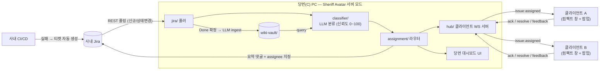

# SVP 아키텍처 (v2 — 클라이언트·서버 + Jira 중심)

> 이 문서는 **목표 구조**를 명세한다. 현재 코드(스켈레톤)는 단일 앱 + mock CI WebSocket 직결 구조이며,
> 차이는 마지막 [현재 구현과의 차이](#현재-구현과의-차이) 참고.
> 세부 명세: [API.md](./API.md) (프로토콜), [BACKEND.md](./BACKEND.md) (백엔드 기능), [DEMO-SCENARIO.md](./DEMO-SCENARIO.md) (데모).

## 토폴로지

- **C(당번) 앱 = 서버 겸용.** 당번 PC의 Sheriff Avatar가 대시보드 UI와 함께 백엔드 전체
  (Jira 폴링 → LLM 분류 → 배정 → Jira 댓글 → 클라이언트 push → WIKI 관리)를 실행한다.
- **A, B(일반 팀원) 앱 = 클라이언트.** 서버에 WebSocket으로 접속해 **자기에게 배정된 이슈만** 받는다.
  클라이언트는 Jira·WIKI·LLM에 직접 접근하지 않는다 — 모든 것은 서버 경유.
- 이슈의 유입은 **Jira 티켓 폴링**이 메인이다. 사내 CI/CD가 실패 시 Jira 티켓을 자동 생성하고(기존 사내 인프라),
  서버가 Jira REST API를 주기 폴링해 신규 티켓을 감지한다.



## 데이터 흐름 (이슈 하나의 사이클)

1. 사내 CI/CD 실패 → **Jira 티켓 자동 생성** (label: `ci-failure` — 기존 사내 인프라)
2. 서버가 Jira를 폴링해 신규 티켓 감지 (기본 30초 주기, 처리 완료 키는 중복 방지 저장)
3. **query** — 티켓의 summary/description/로그로 `wiki-vault/` 검색 (known-failure, 과거 case-log 포함)
4. **classify** — LLM이 티켓 내용 + 매치된 wiki 노트를 읽고 `{category, severity, confidence, summary}` 산출
5. **route** — 신뢰도 **>80**: 해당 모듈 담당자 / **≤80**: 당번 (human-in-the-loop, 당번이 수동 재배정 가능)
6. **Jira 댓글** — 서버가 티켓에 요약 댓글(분류·신뢰도·추정 원인·참고 wiki·배정 근거)을 달고 assignee를 지정
7. **push** — 배정된 팀원의 클라이언트로 `issue:assigned` 전송 → 우하단 팝업. 당번 대시보드에는 전체 이슈 표시
8. 담당자 처리 → **Jira에서 해결 코멘트 + Done 전이** → 폴링으로 Done 확인.
   **앱에는 해결 버튼이 없다** — 해결 코멘트 없는 Done(기록 근거 없는 해결)을 만들지 않기 위해 쓰기는 Jira 한 곳이다
9. **ingest** — Done 확정 시 **LLM이 Jira 해결 코멘트를 근거로 `case-log.md` 항목을 작성** + `index.md`/`log.md` 갱신
   → **다음 같은 유형 이슈의 신뢰도가 올라간다** (compounding)
10. **feedback/lint** — Done 확정 시 서버가 담당자 앱에 "참조 노트의 원인이 실제 원인과 일치했나요?" toast를
    push (일치/불일치 1클릭, 선택 입력). 불일치 누적 노트는 query 감점 + lint 정리 후보 (해결이 Jira로 이동해도
    피드백 접점 유지)

## 상태 관리 — Jira가 source of truth

| 앱 상태 | Jira 상태 (statusCategory) | 전이 주체 |
|---|---|---|
| `new` | To Do (Open) | CI/CD가 티켓 생성 |
| `acknowledged` | In Progress | 앱의 "티켓 확인" 클릭 (티켓이 열리며 동시에 ack) → 서버가 transition 호출 |
| `resolved` | Done | 담당자가 **Jira에서 Done 처리** (유일 경로) → 폴링으로 확정 |

- 담당자가 Jira에서 직접 상태를 바꿔도 서버가 폴링으로 감지해 앱에 반영한다 (양방향 동기화, Jira 우선).
- ingest는 **Jira에서 Done이 확인된 시점**에 1회만 수행한다.

## 가시성 규칙 & 뷰 모드

- **서버 측 필터링**: 클라이언트에는 애초에 자기 이슈만 push된다 (v1 스켈레톤의 renderer 필터링을 대체).
- role = `member` (클라이언트): 컴팩트 창(420×640) — 배정 이슈만 표시/알림
- role = `sheriff` (서버): 전체 대시보드(1180×760) — 팀 전체 이슈 + WIKI 점검 + 수동 재배정
- 모드는 설정으로 결정: `role=sheriff` → 서버 모드로 기동, `role=member` → `SVP_SERVER_URL`로 접속

## 모듈 맵 (목표)

```
src/main/
  modules/jira/            Jira 폴링·댓글·assignee·transition (신규, F1·F5·F7)
  modules/classifier/      LLM 분류 — Claude API (stub → 실구현)
  modules/wiki/            LLM-WIKI 4대 동작 (query/ingest/lint/feedback — 서버 전용)
  modules/assignment/      신뢰도 라우팅 + 당번 수동 재배정
  modules/hub/             클라이언트 WS 서버 — 세션 관리·push (신규, F6)
  modules/hub-client/      클라이언트 모드의 서버 접속 (신규, 기존 websocket/ 대체)
  modules/notifications/   toast (양쪽 공통)
```

- 서버 모드: `jira/ classifier/ wiki/ assignment/ hub/` 활성. 클라이언트 모드: `hub-client/ notifications/`만 활성.
- 모듈 간 통신은 `src/shared/types.ts` 타입으로만 — 기존 규칙 유지.

## wiki 4대 동작 (서버 전용)

| 동작 | 트리거 | 하는 일 |
|---|---|---|
| query | 신규 티켓 감지 시 자동 | 관련 노트 검색, 불일치 누적 노트는 감점 |
| ingest | Jira Done 확정 시 자동 (1회) | **LLM이 Jira 해결 코멘트를 근거로 case-log 작성**, index/log 갱신 |
| lint | 당번의 "WIKI 점검" 버튼 | 고아 노트·불일치 누적 노트(사람 판정 + LLM 대조) 보고 |
| feedback | Done 확정 시 담당자 toast (hub 경유) | "참조 노트의 원인 = 실제 원인?" **일치/불일치** 판정 저장 (불일치 3+ → query 감점) |

- 질문은 "도움됐나요"가 아니라 **원인 일치/불일치**로 묻는다 — 담당자는 문서 품질을 평가할 수 없지만,
  방금 해결한 이슈의 실제 원인과 노트가 맞았는지는 정확히 안다. 상시 👍/👎 버튼은 두지 않는다.
- **LLM 대조 (보조 신호)**: ingest 때 LLM이 노트 내용과 해결 코멘트를 대조해 불일치를 감지하면
  근거 인용을 포함한 structured output(`{ match, quotedNote, quotedResolution }`)으로 **lint 후보에만** 올린다.
  query 감점 권한은 사람 판정에만 있고, 위키 수정·삭제는 어떤 경우에도 자동으로 하지 않는다 (사람 PR 전용).
- Jira는 reopen이 가능하므로 ingest 1회 규칙에는 처리 완료 키 기록이 필요하다 (reopen → 재해결 시 중복 기록 방지).

### vault 저장소와 리뷰 경계

- **이 repo의 `wiki-vault/`는 시드·데모 데이터 전용.** 운영 vault에는 사내 CI 로그·이슈 내용·해결 코멘트가 쌓이므로
  **사내 git 저장소에 별도로 두고, 이 repo(GitHub)로는 절대 push하지 않는다** (CLAUDE.md 절대 규칙 2·4).
- 리뷰는 파일 두 계층으로 나눈다:
  - **자동 생성 파일** (`case-log.md`, `index.md`, `log.md`, `raw/jira/*.md`) — 서버가 기계 커밋(`chore(wiki): ingest <key>`), PR 없음.
    해결 건마다 PR을 만드는 것은 비현실적.
  - **사람이 관리하는 노트** (`modules/*.md`의 known-failure) — 수정·삭제는 PR 리뷰를 거친다.
    lint가 지목한 노트의 diff를 리뷰하는 이 시점이 사람이 사실성을 검토하는 지점이다.

## 현재 구현과의 차이

| 영역 | 현재 (스켈레톤) | 목표 (이 문서) |
|---|---|---|
| 배포 형태 | 전원 동일 앱, 역할은 화면 전환 | C = 서버 겸용, A/B = 클라이언트 |
| 이슈 유입 | CI가 WebSocket으로 직접 push (`mock:ci`) | Jira 티켓 폴링 (개발은 mock Jira — [API.md §4](./API.md)) |
| 분류 | stub (wiki 매치 점수 기반 가짜 신뢰도) | Claude API 실호출 |
| 필터링 | renderer에서 클라이언트 측 필터 | 서버 측 필터 (자기 이슈만 push) |
| 상태 | 앱 로컬 (in-memory) | Jira가 source of truth, 폴링 동기화 |
| Jira 댓글 | 없음 | 배정 시 요약 댓글 자동 |

기존 `mock/ci-server.mjs`와 `modules/websocket/`은 mock Jira 서버·`hub-client/`로 대체될 때까지 개발용으로 유지한다.
