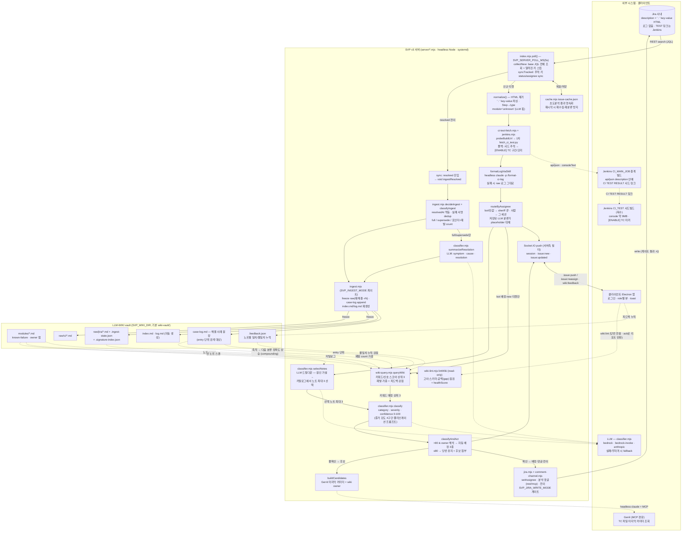

# SVP 아키텍처 (v3 — 현행)

> 이 문서는 **현재 구현된 구조**를 기술한다. 코드와 어긋난 내용을 발견하면 그 PR에서 같이 고친다.
> 설정·운영(.env, Linux systemd 배포)은 [SETUP.md](./SETUP.md), vault 스키마는
> [wiki-vault/README.md](../wiki-vault/README.md) 참고.

## 토폴로지

- **서버** = headless Node 프로세스 (`server/*.mjs`, plain ESM, 포트 `SVP_SERVER_PORT` 기본 8793).
  백엔드 전체 — Jira 폴링 → Jenkins 로그 보강 → LLM 분류 → 배정 → Jira write → Socket.IO push →
  해결 시 vault ingest — 를 실행한다. 운영 홈은 Linux 호스트의 systemd 서비스 (`npm run server`는 로컬 실행).
- **전원(당번 포함) 앱 = Windows Electron 클라이언트 (동일 EXE, 순수 클라이언트).**
  로그인 → push 수신 → UI 렌더링만 한다. 역할 구분은 서버 측 필터링 하나로 끝난다:
  member 세션에는 자기 배정분만, sheriff 세션에는 전체 이슈를 push.
- **비밀정보는 서버에만 존재한다.** Jira PAT·Jenkins token·LLM 자격증명은 서버 호스트의 `.env`에만.
  클라이언트 필수 설정은 `SVP_PUSH_URL` 하나 (기본 `http://localhost:8793`; 선택 옵션은 API.md §6).
- 이슈 유입은 **Jira 티켓 폴링**이다. 사내 CI/CD가 실패 시 Jira 티켓을 자동 생성하고(기존 사내 인프라),
  서버가 Jira REST를 주기 폴링해 감지한다. 클라이언트는 Jira·WIKI·LLM에 직접 접근하지 않는다.

## 전체 파이프라인

```mermaid
flowchart TB
  subgraph EXT["외부 시스템 · 클라이언트"]
    JIRA[("Jira 사내<br/>description = ' : ' key-value HTML<br/>로그 없음 · TEST 링크는 Jenkins")]
    RELAY["Jenkins CI_MAIN_JOB 중계빌드<br/>api/json description 안에<br/>CI TEST RESULT 샤드 링크"]
    SHARD["Jenkins CI_TEST 샤드빌드 (복수)<br/>console 약 9MB · [ENABLE] TC 마커"]
    GERRIT["Gerrit (MCP 경유)<br/>TC 파일 마지막 커미터 조회"]
    CLIENT["클라이언트 Electron 앱<br/>로그인 · role별 뷰 · toast"]
    LLMN["LLM — classifier.mjs<br/>bedrock · bedrock-invoke · anthropic<br/>실패/무자격 시 fallback"]
  end

  subgraph SRV["SVP v3 서버 (server/*.mjs · headless Node · systemd)"]
    POLL["index.mjs poll() — SVP_SERVER_POLL_MS(5s)<br/>collectNew: base JQL 전체 조회 + 알려진 키 스킵<br/>syncTracked: 추적 키 status/assignee sync"]
    CACHE["cache.mjs issue-cache.json<br/>초도분석 결과 영속화<br/>재시작 시 재수집·재분류 방지"]
    NORM["normalize() — HTML 제거<br/>' : ' key-value 파싱 · Step→type<br/>module='unknown' (LLM 몫)"]
    JENK["ci-test-fetch.mjs + jenkins.mjs<br/>probeBuildUrl → 1차 fetch_ci_test.py<br/>폴백: 샤드 추적 → [ENABLE] TC 구간/꼬리"]
    FMT["formatLogViaSkill<br/>headless claude -p /format-ci-log<br/>실패 시 raw 로그 그대로"]
    ROUTE["routeByAssignee<br/>bot/빈값 → sheriff 큐 · 사람 → 그 세션<br/>저장된 LLM 분류가 placeholder 대체"]
    WQ["wiki-query.mjs queryWiki<br/>키워드/신호 스코어 상위 3<br/>재발 가중 + 피드백 감점"]
    SEL["classifier.mjs selectNotes<br/>LLM 드릴다운 — 원인 가설 →<br/>카탈로그에서 노트 최대 3 선택"]
    CLS["classifier.mjs classify<br/>category · severity · confidence 0-100<br/>(증거 강도 4구간 캘리브레이션 프롬프트)"]
    ACT["classifyAndAct<br/>>80 & owner 해석 → 자동 배정 3종<br/>≤80 → 당번 유지 + 후보 첨부"]
    CAND["buildCandidates<br/>Gerrit 마지막 커미터 + wiki owner"]
    JWRITE["jira.mjs + comment-channel.mjs<br/>setAssignee · 분석 댓글(rest/mcp) · 전이<br/>SVP_JIRA_WRITE_MODE 게이트"]
    PUSH["Socket.IO push (서버측 필터)<br/>session · issue:new · issue:updated"]
    LINT["wiki-lint.mjs lintWiki (read-only)<br/>고아·스키마·공백(gap) 점검 + healthScore"]
    TRIG["sync: resolved 진입<br/>→ void ingestResolved"]
    DEDUP["ingest.mjs decideIngest + classifyIngest<br/>resolvedAt 멱등 · 실패 서명 dedup<br/>full / supersede / 포인터+재발 count"]
    SUMM["classifier.mjs summarizeResolution<br/>LLM: symptom · cause · resolution"]
    INGEST["ingest.mjs (SVP_INGEST_MODE 게이트)<br/>freeze raw(재해결 -rN) · case-log append<br/>index.md/log.md 재생성"]
  end

  subgraph VAULT["LLM-WIKI vault (SVP_WIKI_DIR, 기본 wiki-vault/)"]
    MOD["modules/*.md<br/>known-failure · owner 맵"]
    CASE["case-log.md — 해결 사례 원장<br/>(entry 단위 검색 대상)"]
    IDX["index.md · log.md (자동 생성)"]
    RJIRA["raw/jira/*.md + .ingest-state.json<br/>+ .signature-index.json"]
    RCI["raw/ci/*.md"]
    FB[".feedback.json<br/>노트별 일치/불일치 누적"]
  end

  JIRA -->|"REST search (JQL)"| POLL
  POLL <-->|"복원/저장"| CACHE
  POLL -->|"신규 티켓"| NORM
  NORM --> JENK
  JENK -.->|"api/json · consoleText"| RELAY
  RELAY -.->|"CI TEST RESULT 링크"| SHARD
  JENK --> FMT
  FMT --> ROUTE
  ROUTE --> PUSH
  ROUTE -->|"bot 배정 new 티켓만"| WQ
  ROUTE --> SEL
  MOD -.->|"노트·owner"| WQ
  CASE -.->|"entry 단위"| WQ
  RJIRA -.->|"재발 count 가중"| WQ
  FB -.->|"불일치 누적 감점"| WQ
  MOD -.->|"카탈로그"| SEL
  SEL -.-> LLMN
  CLS -.-> LLMN
  WQ -->|"키워드 매칭 상위 3"| CLS
  SEL -->|"선택 노트 최대 3"| CLS
  CLS --> ACT
  ACT -->|"확신 → 배정·댓글·전이"| JWRITE
  ACT -->|"불확신 → 후보"| CAND
  CAND -.->|"headless claude + MCP"| GERRIT
  JWRITE -->|"write (게이트 통과 시)"| JIRA
  ACT --> PUSH
  PUSH <-->|"issue push /<br/>issue:reassign · wiki:feedback"| CLIENT
  CLIENT -.->|"피드백 누적"| FB
  CLIENT -.->|"wiki:lint (당번 전용 · ack로 리포트 반환)"| LINT
  MOD -.->|"전 노트 스캔"| LINT

  POLL -->|"resolved 전이"| TRIG
  TRIG --> DEDUP
  DEDUP -->|"full/supersede만"| SUMM
  SUMM -.-> LLMN
  DEDUP --> INGEST
  SUMM --> INGEST
  INGEST --> CASE
  INGEST --> IDX
  INGEST -->|"freeze"| RJIRA
  INGEST -->|"freeze"| RCI
  CASE -.->|"축적 → 다음 분류 정확도 상승 (compounding)"| WQ
```

## 데이터 흐름 ① — 인입 (신규 티켓)

1. `poll()`이 `SVP_SERVER_POLL_MS`(기본 5000ms) 주기로 base JQL(`SVP_JIRA_JQL`) 전체를 조회하고
   알려진 키를 스킵한다. `created >=` 경계를 쓰지 않는 이유: Jira **프로필 타임존**으로 해석되어
   신규 티켓이 조용히 누락된다. `poll()`은 신규 수집(`collectNew`)과 추적 키 동기화(`syncTracked`)로
   나뉘어 **각각** single-flight 가드를 가진다 — Jenkins fetch로 수집이 수 초를 넘어도 겹치지 않고,
   sync는 그동안에도 계속 돌아 자동 배정 결과가 수집 완료를 기다리지 않는다. sync는 진행 중 들어온
   재실행 요청을 버리지 않고 사이클 종료 후 한 번 더 도는 코얼레싱(`syncAgain`)이라 배정 직후의
   재읽기가 다음 tick까지 밀리지 않는다.
2. `normalize()` — description의 HTML을 걷어내고 ` : ` key-value 계약을 파싱한다
   (`Step`→type, `CICD Project`→branch). `module`은 `'unknown'` 고정 — 모듈 판단은 LLM 분류가 한다.
3. **Jenkins 로그 보강** — description에는 실패 로그가 없다. `extractBuildUrl` → `probeBuildUrl`
   (죽은 링크에 fetch를 태우지 않음) → 1차 `fetchRawLogViaTool`(`python3 .tool/Jenkins/fetch_ci_test.py` —
   사내 전용 자산, [INTERNAL-ASSETS.md](./INTERNAL-ASSETS.md) 참고) → 실패 시 `fetchFailureLog` 폴백
   (중계빌드 api/json → `CI TEST RESULT` 샤드 링크 → `result !== 'SUCCESS'` 샤드 콘솔에서 해당 TC의
   `[ENABLE]` 구간 추출, 못 찾으면 꼬리 `SVP_JENKINS_LOG_TAIL`) → 확보한 로그는 `formatLogViaSkill`
   (headless `claude -p "/format-ci-log"`, `.claude/skills` — 사내 전용 자산)로 양식화하되 실패하면 raw 그대로.
4. `routeByAssignee` — **Jira assignee 필드가 배정 원장이다.** bot(`SVP_JIRA_BOT`)·빈값 → 당번(admin) 큐
   (placeholder confidence 50), 사람 → 그 사용자 세션 (placeholder 95). 저장된 LLM 분류가 있으면 placeholder를 덮는다.
5. `issue:new` push 후, classifier가 켜져 있고 **당번 큐(routedTo=sheriff) + status new**인 티켓만
   처리한다 — 캐시에 저장된 분류가 있으면 `reassignFromCache`(아래 §영속화), 없으면 `classifyAndAct`:
   - `queryWiki`(키워드/신호 스코어) ∪ `selectNotes`(LLM이 로그로 원인 가설을 세우고 카탈로그에서 노트 최대 3개 선택)
     → `classify`(provider `SVP_LLM_PROVIDER`: `bedrock`/`bedrock-invoke`/`anthropic`, 실패·무자격 시
     confidence 0 fallback) → 결과를 `issue:updated`로 push (≤80이어도 당번 화면에 근거가 보인다).
   - `classify` 프롬프트는 신뢰도를 **wiki 증거 강도** 기준 4구간으로 캘리브레이션한다 — 85–95(제공된
     노트가 이 실패를 직접 문서화 — 직접 매치는 반드시 80 초과) / 65–80(모듈은 맞지만 이 패턴은 미기록) /
     51–64(약한 근거) / 50 이하(무근거, evidence 비움). 임계값 80이 "당번 검토 없이 배정"의 경계가 되는 근거다.
   - confidence **> `SVP_LLM_CONFIDENCE_MIN`(80)** 이고 category ≠ `unknown`이고 노트 frontmatter
     `owner:`로 담당자가 해석되면: `setAssignee` → 분석 댓글 → `In Progress` 전이. 순서가 곧 정책이다 —
     assignee가 성공하기 전에는 댓글을 달지 않고(배정 없는 "자동 배정" 댓글 방지), 댓글·전이 실패는
     로그만 남기고 진행한다(배정은 이미 완료). `setAssignee`는 전용 assignee 엔드포인트가 표시명을
     400으로 거부하면 issue-edit(`PUT /rest/api/2/issue/{key}`)으로 폴백한다 — 사내 Jira 실측으로 확인된 케이스.
   - `owner:`는 스칼라와 YAML 블록 리스트(다중 담당) 모두 지원 — 첫 항목이 주 담당(자동 배정 대상)이고,
     전원이 로그인 roster의 `ownedModules`로 연결된다(첫 로그인 전에도 배정 가능). 테스트 오버라이드
     `SVP_FORCE_ASSIGNEE`는 confidence 게이트를 그대로 둔 채 배정 **대상만** 이 사용자로 고정한다
     (설정 시 기동 로그에 ⚠ 경고, 운영에서는 비워둔다).
   - 그 외(불확신·담당자 미등록·분류 중 상태 이동)에도 **분석 댓글은 게시**하고, 불확신 케이스는
     `buildCandidates`(Gerrit MCP로 TC 파일 마지막 커미터 + wiki module owner)를 이슈에 첨부해 당번의 수동 배정을 돕는다.
6. **모든 서버발 Jira write는 `canWrite` 게이트를 거친다** — `SVP_JIRA_WRITE_MODE`:
   `dry-run`(기본, 로그만) / `label`(`SVP_TEST_LABEL` 붙은 티켓만) / `live`.
   분석 댓글 채널은 `SVP_COMMENT_CHANNEL`: `rest`(기본, Jira REST 직접) / `mcp`(headless claude가 MCP Jira 툴로 기입, 실패 시 REST 폴백).

## 데이터 흐름 ② — 해결 (resolve → ingest)

1. `poll()`의 sync 단계가 추적 키를 `key in (...)`로 재조회한다 — base JQL을 떠난 티켓(예: Resolved 제외
   JQL)과 resolved 티켓(reopen 감지)도 계속 본다. status/assignee 변경은 `issue:updated`로 push (이전 담당자 포함).
2. `resolved` 진입 시 `ingestResolved(issue, updated)`를 fire-and-forget으로 실행하고 issue-cache를 정리한다.
   reopen(resolved→open)은 활성 큐로 복귀 + **분류 결과를 포함한** 캐시 복원 — 재분류 없이 추적을
   재개하고, 확신 티켓이 여전히 당번 큐면 `reassignFromCache`가 배정 단계만 다시 수행한다.
3. `decideIngest` — **해결 이벤트 단위 멱등성** (`raw/jira/.ingest-state.json`의 resolvedAt).
   재시작·중복 폴링(같은 resolvedAt)은 스킵, reopen 후 더 늦은 resolvedAt은 재기록(n+1).
4. `signatureOf`(TC명 우선, 없으면 제목 정규화) + `classifyIngest`로 기록 모드를 정한다:

   | 모드 | 조건 | case-log 기록 |
   |---|---|---|
   | `full` | 신규 서명 / 시간창 만료 | 풀 엔트리 + 새 anchor |
   | `anchor-reresolve` | anchor 티켓의 reopen 재해결 | supersede 표식 풀 엔트리, count 유지 |
   | `member-reresolve` | 이미 dedup된 티켓의 재해결 | anchor 포인터, count 유지 (재anchor 금지) |
   | `recurrence` | 같은 서명·같은 모듈·`SVP_DEDUP_WINDOW_DAYS`(14일) 내 새 티켓 | anchor 포인터 + count+1, LLM summarize 스킵 |

5. `SVP_INGEST_MODE`가 `live`일 때만(기본 `dry-run`) 실제 기록: `raw/jira/<키>[-r<n>].md`·`raw/ci/` 동결
   (raw는 재발이어도 티켓마다 보존) → full/anchor-reresolve는 `summarizeResolution`(LLM이 해결 코멘트에서
   symptom/cause/resolution 추출, 무자격 시 symptom만) → `case-log.md` append → `index.md`/`log.md` 재생성.

## Retrieval self-correction (`wiki-query.mjs` — 전부 단위 테스트 대상)

- **case-log entry 단위 스코어링** — 포인터 엔트리(재발/재해결 → anchor)는 지식이 아니라 링크이므로 제외,
  같은 티켓 id의 full 엔트리는 최신만 검색된다 (reopen 교정본이 이전 기록을 supersede).
- **recurrenceBoost** — `.signature-index.json`의 재발 count가 높은 사례를 `min(count-1, SVP_RECUR_BOOST_CAP=4)` 가산.
- **feedbackDemotion** — 담당자 피드백이 불일치 `SVP_FEEDBACK_DEMOTE`(3) 이상이고 불일치 > 일치인 노트는
  점수 절반. `recordFeedback`이 `<vault>/.feedback.json`에 누적한다.
- 기본 스코어: module 키워드 +3, 일반 키워드 +1, 노트 신호(태그·known-failure 원문 토큰)의 티켓 텍스트 매치 +2. 상위 3개 반환.

## 영속화

- `server/issue-cache.json` (`cache.mjs`) — 티켓별 초도분석 결과(Jenkins 보강 로그·url·LLM 분류·후보)를
  재시작 간 보존한다. 복원 push는 `restored: true`로 재toast를 막는다. Jira가 진실이므로 이 파일을 잃어도
  재분석 비용만 있을 뿐 정합성은 깨지지 않는다.
- 복원된 티켓 중 캐시 분류가 확신(> 임계)인데 아직 당번 큐에 남아 있는 경우(분류 시점이 dry-run이었거나,
  `setAssignee` 실패, Jira에서 assignee가 되돌려진 경우)는 `reassignFromCache`가 **배정 단계만** 재시도한다 —
  재분류·재댓글·재전이 없음. dry-run으로 검증한 뒤 live로 전환하면 재분류 없이 캐시 점수로 곧바로
  배정되는 것도 이 경로다.
- vault 쪽 상태: `raw/jira/.ingest-state.json`(멱등), `raw/jira/.signature-index.json`(dedup/재발), `.feedback.json`(피드백).

## 상태 관리 — Jira가 source of truth

| 앱 상태 | Jira statusCategory | 전이 주체 |
|---|---|---|
| `new` | To Do | CI/CD가 티켓 생성 |
| `acknowledged` | In Progress | 자동 배정 시 서버의 `transitionTo`, 또는 담당자가 Jira에서 직접 |
| `resolved` | Done | 담당자가 **Jira에서 Done 처리** (유일 경로) → 폴링으로 확정 |

- **앱은 이슈 상태를 쓰지 않는다** (해결·확인 버튼 없음). 서버도 로컬 상태를 직접 움직이지 않는다 —
  Jira에 write하고 폴링 sync가 변경을 읽어 push하는 단방향 루프다. Jira에서 직접 바꾼 것도 같은 경로로 앱에 반영된다.

## Push 계약 (Socket.IO) & 가시성

- 로그인 = handshake auth `{username, password}`. 데모 인증(admin/admin = sheriff, 아이디=비밀번호 = member) —
  SVP-5에서 실인증 교체 예정. 성공 시 서버가 `session { user, team, confidenceMin }`을 내려주고 이 세션의
  미해결 이슈를 `issue:new`로 replay한다. `confidenceMin`은 서버 게이트 `SVP_LLM_CONFIDENCE_MIN`이 내려오는
  값 — 클라이언트의 브래스 스타 표기·툴팁·후보 합성 기준이 전부 이 값을 따라 서버와 같은 임계를 쓴다.
- 서버→클라: `session`, `issue:new`(restored 플래그), `issue:updated`. 클라→서버: `issue:reassign`(sheriff 전용),
  `wiki:feedback`, `wiki:lint`(sheriff 전용 — ack 콜백으로 `WikiLintReport` 반환, 클라이언트는 10초
  타임아웃으로 미응답·권한 거부를 null 처리).
- **서버 측 필터링**: 이슈는 assignee 본인 + 모든 sheriff 세션에만 push된다. role은 클라이언트가 주장하지 않고
  서버 인증이 결정한다.

## 클라이언트 (Electron)

- member: 420×640 컴팩트 창(`CompactView`) — 자기 배정 이슈만. sheriff: 1440×700 대시보드
  (`Cockpit` + 상태 lane + `StatusBoard` + `DetailPanel`) — 전체 이슈 + 검색 + Ctrl+K 커맨드 팔레트.
- 티켓 표시·검색·현황 집계의 모듈은 **분류 category 우선, CI 필드는 fallback**(`moduleOf` — Jira 유입 시
  `event.module`은 항상 `'unknown'`). 당번 대시보드의 모듈별 집계와 실패 서명 기반 중복 그룹(`dupGroups`)도
  클라이언트가 보유 이슈에서 이 규칙으로 파생한다.
- toast 팝업(TTL 9초), tray 상주(닫기 = tray로 숨김) + 알림 음소거.
- 설치형(packaged EXE)에서만 `requestSingleInstanceLock`으로 단일 인스턴스를 강제한다 — 이중 실행 시
  두 번째 로그인이 첫 창의 서버 세션을 끊는다. dev는 당번+팀원 동시 실행 확인이 필요해 제외.
- sheriff 전용: 수동 재배정(`issue:reassign` — 후보 버튼은 서버 `buildCandidates` 결과를 우선 쓰고,
  서버 후보가 없고 confidence ≤ confidenceMin이면 클라이언트가 wiki 모듈 owner로 합성해 항상 클릭
  가능한 후보를 보여준다), 위키 열기(`obsidian://`, 미등록 시 OS 기본), 위키 점검(`wiki:lint` — **서버
  운영 vault 대상**. `server/wiki-lint.mjs`가 read-only로 고아 노트(단어 경계 매칭), frontmatter 스키마
  위반(필수 5필드 + module=파일명 일치), 공백 탐지(노트 없는 카테고리로 티켓이 쌓이는 곳 — 역방향 lint),
  피드백 불일치 누적 노트를 심각도별 감점(critical 15 / warn 10 / info 3)의 healthScore와 함께 보고).
- 피드백: **resolved 이슈에서** 참조 노트의 "원인 일치/불일치" 판정 (member는 CompactView,
  sheriff는 DetailPanel) → `wiki:feedback`으로 서버 vault에 누적 (query 감점 루프의 입력).

## vault 저장소와 리뷰 경계

- **이 repo의 `wiki-vault/`는 시드·데모 데이터 전용.** 운영 vault에는 사내 CI 로그·이슈 내용·해결 코멘트가
  쌓이므로 서버 호스트에 두고(`SVP_WIKI_DIR`), 사내 git으로 백업·리뷰한다 — 이 repo로는 절대 push하지
  않는다 (CLAUDE.md 절대 규칙 2·4). 클라이언트는 운영 vault 파일에 직접 접근하지 않는다.
- 리뷰 두 계층: **자동 생성 파일**(`case-log.md`, `index.md`, `log.md`, `raw/**`, 상태 json) — 서버가 기록,
  PR 없음. **사람이 관리하는 노트**(`modules/*.md` known-failure) — 수정·삭제는 PR 리뷰를 거친다.
  lint·피드백 감점이 지목한 노트를 사람이 검토하는 지점이 여기다.
