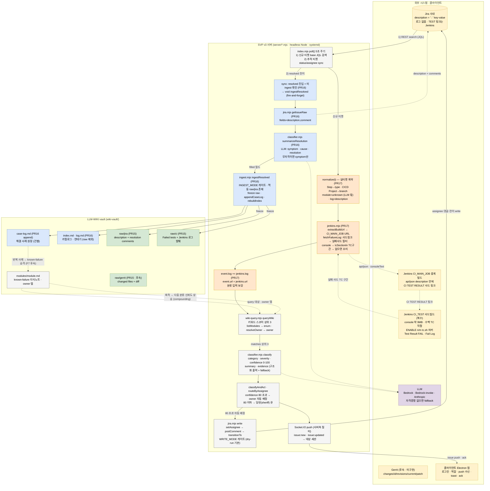

# SVP v3 파이프라인 — PR #15 / #16 / #17 통합 동작 구조

CI/CD 실패가 Jira 티켓이 되고 → 서버가 폴링·분류·배정하고 → 해결되면 LLM-WIKI로 축적되어
다음 분류가 더 정확해지는 전체 흐름. 세 PR을 색으로 구분한다.

## 색상 범례

| 색 | 범위 |
|---|---|
| 🟩 초록 | **#15** raw 3-소스 스키마 (jira/ci/gerrit + correlation key) |
| 🟦 파랑 | **#16** ingest — 해결 티켓을 vault로 동결·기록 |
| 🟧 주황 | **#17** Jenkins 실패 로그 수집 + 실티켓 계약 파싱 |
| ⬜ 회색 | 기존 v3 서버 (이미 구현됨) |
| 🟨 노랑 | 외부 시스템 / 클라이언트 |
| 🟪 보라 | LLM |

## 전체 파이프라인

## 두 갈래 흐름

**① INBOUND — 신규 티켓 (주황 #17이 핵심)**

`poll()`이 base JQL로 신규 티켓을 잡으면 `normalize()`가 실티켓 description(`' : '` key-value)을
파싱한다. description에는 로그가 없으므로 **`jenkins.mjs`(#17)** 가 TEST 링크의 CI_MAIN_JOB
중계빌드 → `CI TEST RESULT` 샤드빌드(build description의 api/json) → 실패 샤드(result ≠ SUCCESS)
console에서 해당 TC의 `[ENABLE]` 구간만 추출해 `event.log`를 보강한다. 이 보강된 로그가
wiki query → classifier(LLM)의 입력이 되고, confidence 80 초과면 Jira에 자동 배정한다.

**② OUTBOUND — 해결 감지 → ingest (파랑 #16이 핵심)**

`poll()`의 sync 단계가 티켓의 `resolved` 진입을 감지하면(미ingest일 때 1회) **`ingestResolved`(#16)** 가
`getIssueRaw`로 description·해결 코멘트를 가져오고, `summarizeResolution`(LLM)이 symptom/cause/
resolution을 채운 뒤, **#15 스키마**대로 `raw/jira`·`raw/ci`를 동결하고 `case-log`·`index`·`log`를
갱신한다. 축적된 case-log는 반복 사례를 known-failure로 승격시켜 **다음 분류의 신뢰도를 높인다(compounding).**

## PR별 기여 요약

| PR | 파일 | 하는 일 | 꽂히는 지점 |
|---|---|---|---|
| **#17** 🟧 | `server/jenkins.mjs`, `index.mjs normalize()` | 실티켓 파싱 + Jenkins 2단 로그 수집으로 분류 입력 보강 | poll() **신규 티켓** 단계 |
| **#16** 🟦 | `server/ingest.mjs`, `jira.mjs getIssueRaw`, `classifier.mjs summarizeResolution` | 해결 티켓을 vault로 동결·기록 (sink) | poll() **추적 sync**(resolved) 단계 |
| **#15** 🟩 | `wiki-vault/README.md`, `raw/{ci,gerrit}` | ingest가 쓰는 raw 3-소스 스키마·correlation key 정의 | vault 저장 구조 |

세 PR이 `poll()`의 서로 다른 단계에 꽂혀 하나의 파이프라인을 이룬다: #17이 채운 `event.log`가 곧
분류 입력이자, 해결 시 #16이 `raw/ci`(#15 스키마)로 동결하는 데이터다.
